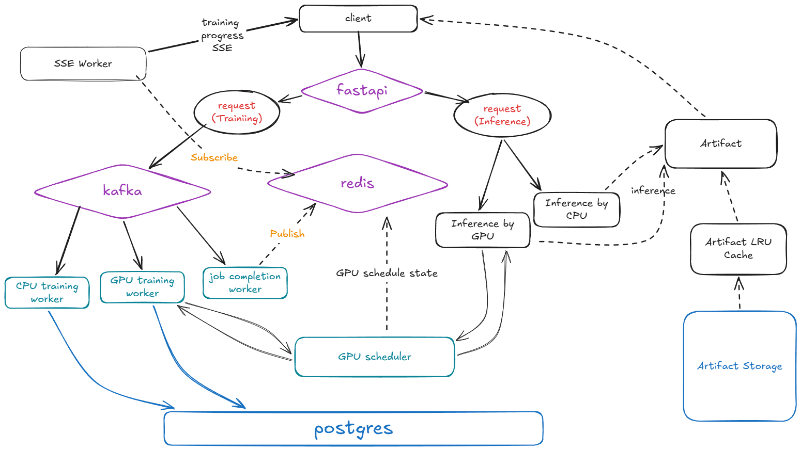
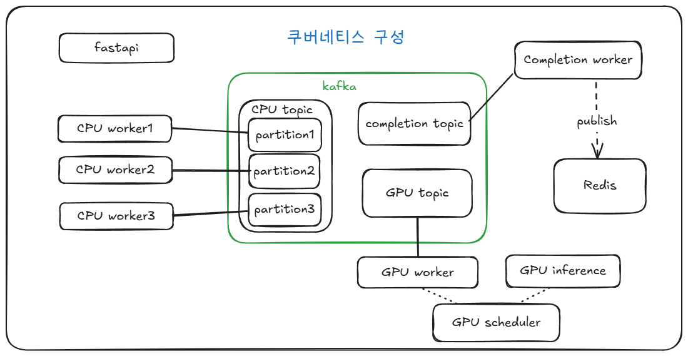
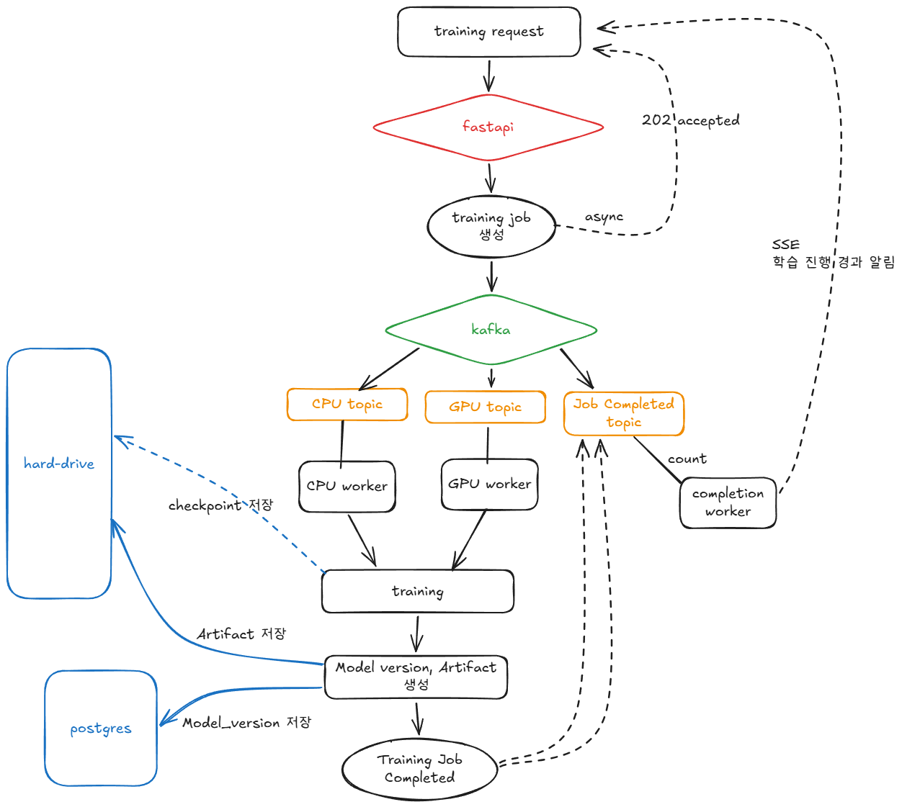
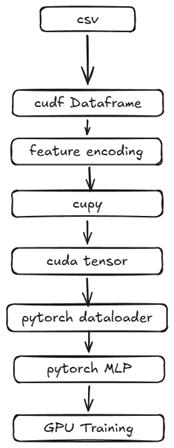
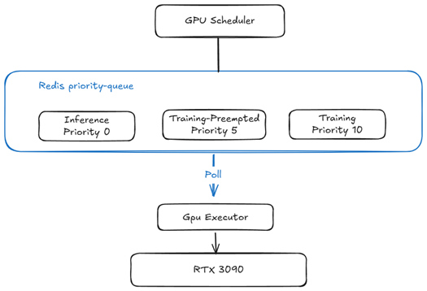
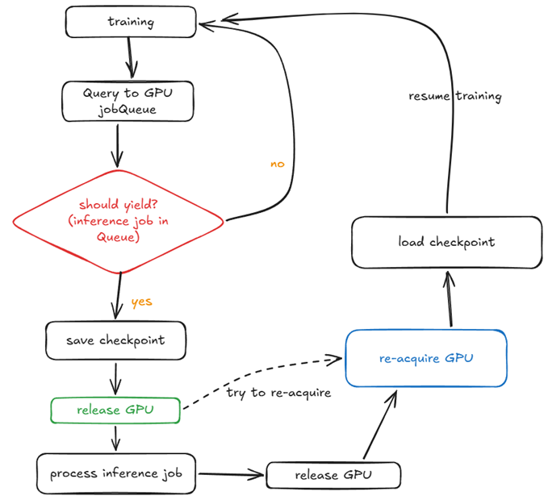
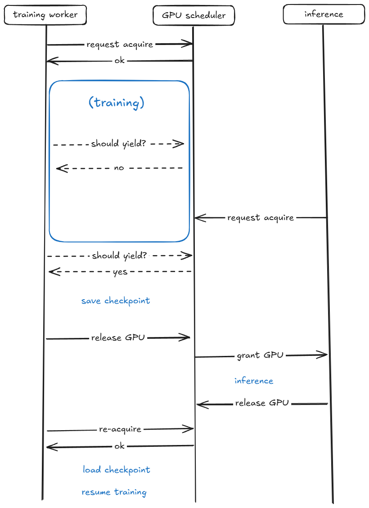
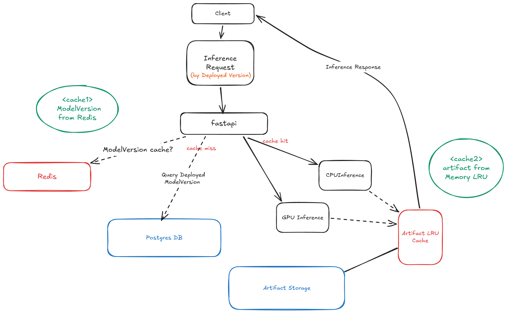
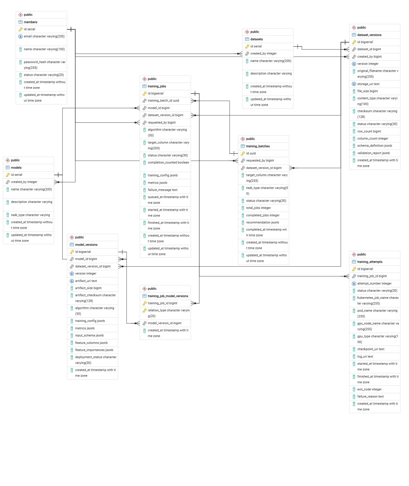

# ModelServeMini

소규모 ML Training & Serving Platform입니다.  
Kafka 기반 비동기 모델 학습과 추론, Kubernetes 환경의 GPU Scheduling을 지원합니다.

사용자가 업로드한 데이터셋을 기반으로 여러 머신러닝 알고리듬의 학습 기능을 제공하고,  
학습 결과를 비교하여 모델 버전을 생성, 생성된 모델에 의한 추론 기능을 제공합니다.

Kafka를 사용해 CPU / GPU 학습 작업을 분리했으며   
장시간 실행되는 학습 도중 예기치 못한 중지를 대비한 체크포인트 기능,   
단일 GPU 환경에서 장시간 실행되는 training과 짧은 inference 간의 GPU 경쟁을 해결하기 위해 Priority GPU Scheduler에 의한 Preemption / Resume 기능을 제공합니다.

**사용기술**  
FastAPI, PostgreSQL, Apache Kafka, Redis, Docker, Kubernetes(k3s)

<br>

## Summary


<br>

## 1. Project Overview

### Motivation

ML 플랫폼 아키텍처 설계 과제를 받게 되었고 과제 완료 이후에도 해당 설계를 바탕으로 실제로 기능을 완성시켜보고 싶었습니다. 그리고 그 과정에서 몇가지 문제를 해결해보려 했습니다.

- 시간이 오래 걸리는 모델 학습 작업을 어떻게 처리할 것인가?
    - 도중에 중단되면 어떻게 복구할 것인가?
    - 한정된 GPU 자원을 어떻게 추론 작업과 공유할 것인가?
- 여러 학습 작업을 Worker들에 어떻게 분산 시킬 것인가?
- CPU와 GPU 학습 작업은 어떻게 분리할 것인가?

ModelServeMini는 이러한 문제를 직접 구현하고 검증하기 위해 시작한 프로젝트입니다.

<br>

## 2. Key Features

### Dataset / Model

- CSV Dataset 업로드 및 버전 관리
- Classification / Regression 학습 지원
- Model / ModelVersion 관리
- 학습 결과 Metric 저장
- Feature Importance 계산
- 학습된 모델을 이용한 Inference

### Asynchronous Training

- Kafka 기반 비동기 Training Job 처리
- CPU / GPU Training Topic 분리
- Kafka Partition 기반 CPU Worker 작업 분산
- Training 과정 SSE 기반 메시징
- CPU Worker / GPU Worker 독립 실행

### GPU

- XGBoost GPU Training
- PyTorch MLP Classification / Regression
- RAPIDS cuDF 기반 GPU Data Processing
- GPU Inference
- NVIDIA Device Plugin 기반 Kubernetes GPU Resource 관리
- GPU Time-Slicing

### GPU Resource Scheduling

- Redis 기반 GPU Scheduler
- Training / Inference Priority 관리
- Inference 우선 스케쥴링
- PyTorch Training Checkpoint 저장
- Training Preemption
- Inference 완료 후 Training Resume

<br>

## 3. Architecture in kubernetes


<br>

```text
fastapi
CPU Worker × 3
GPU Worker
GPU Inference
GPU Scheduler
Completion Worker
Kafka
Redis
NVIDIA Device Plugin
```

<br>

| Component | Responsibility |
|---|---|
| FastAPI | REST API 및 Training / Inference 요청 처리 |
| k3s | Worker 및 GPU Workload Orchestration |
| Kafka | 비동기 CPU / GPU Training Job 및 Completion Event 전달 |
| CPU Worker | CPU 기반 머신러닝 모델 학습 |
| GPU Worker | XGBoost / PyTorch GPU 모델 학습 |
| Completion Worker | Training 완료 이벤트 처리 |
| GPU Inference | GPU 기반 모델 추론 |
| GPU Scheduler | GPU 사용권 및 Training / Inference Priority 관리 |
| Redis | SSE pub-sub 및 GPU Scheduler State, Model Version cache 관리 |
| PostgreSQL | Dataset, Model, Training Job, Model Version Metadata 관리 |

<br>

## 4. Training Flow

모델 학습은 수 초에서 수 시간까지 실행될 수 있기 때문에 Kafka를 통해 비동기 작업으로 처리합니다.

<br>



CPU topic은 cpu-worker들의 병렬 처리를 위해 여러 개의 파티션으로 구성.  
GPU topic은 GPU작업 처리에 Local GPU 한대를 사용했으므로 파티션은 1개,  
대신 training-worker와 inference-worker를 분리했음

<br>

## 5. Supported Algorithms

| Task | CPU | GPU |
|---|---|---|
| Classification | Logistic Regression | XGBoost Classifier |
| Classification | Random Forest Classifier | PyTorch MLP Classifier |
| Classification | Gradient Boosting Classifier | |
| Regression | Linear Regression | XGBoost Regressor |
| Regression | Random Forest Regressor | PyTorch MLP Regressor |
| Regression | Gradient Boosting Regressor | |

<br>

## 6. GPU Training Pipeline

GPU Training에서는 CPU 기반 Pandas preprocessing으로 인해 불필요한 CPU ↔ GPU 데이터 이동이 발생하지 않도록 cuDF를 이용하여 데이터를 GPU 메모리에서 처리합니다.

PyTorch Training Pipeline은 다음과 같이 구성했습니다.  



<br>

## 7. GPU Resource Scheduling


개발 환경에서 하나의 NVIDIA GPU를 Training과 Inference에 함께 사용했습니다.  
장시간 Training이 GPU를 점유한 상태에서는 Inference 요청의 latency가 증가할 수 있습니다.

해결을 위해 **Time-Slicing과 Scheduling** 두가지 방법으로 접근했습니다.

**Time-Slicing 결과**  
NVIDIA Time-Slicing + K3s + RTX3090(24GB) 환경에서 XGBoost GPU 학습과 추론 동시 수행시,   
GPU Util은 65%→87%로 증가, 추론 지연은 약 170ms→320ms로 증가했습니다.  
VRAM 사용량 증가는 거의 없었고 병목은 GPU Compute 자원 공유에 의해 발생한 것으로 보입니다.  
지금과 같은 작은 학습 알고리듬에 대해서는 현재의 Time-Slicing으로 충분하지만   
무거운 알고리듬 학습에 대비해서는 Scheduling도 필요할 것입니다.  
(로그 기록 하단 첨부)

**GPU-Scheduling**



낮은 Priority 값 우선 정책.  
Inference 요청이 대기 중인 경우 실행 중인 Training Worker는 GPU를 양보.

<br>


## 8. Training Preemption & Resume Detail

PyTorch Training은 일정 주기로 GPU Scheduler에 더 높은 우선순위의 Task가 대기 중인지 확인합니다.

Inference 요청이 감지되면 다음 과정이 수행됩니다.



<br>

Checkpoint에는 모델뿐만 아니라 Optimizer 및 학습 진행 위치를 저장했습니다.  
GPU Resume 후에는 이전 마지막 진행 위치부터 학습을 재개합니다.

<br>

**Sequence**



(테스트 로그 하단 첨부)

<br>


## 9. Feature Importance

학습된 모델의 결과를 단순 Metric뿐 아니라 Feature 단위로 분석할 수 있도록
Feature Importance를 계산해서 저장합니다.
PyTorch MLP에서는 Permutation 기반 Feature Importance를 사용합니다.

예:
```json
[
  {
    "feature": "previous_grade",
    "importance": 0.085
  },
  {
    "feature": "study_time_hours",
    "importance": 0.015
  }
]
```

Categorical Feature가 One-Hot Encoding을 통해 여러 Column으로 확장된 경우에도
사용자에게 내부 Encoding Column을 그대로 노출하지 않고 원본 Feature 단위로 Importance를 집계합니다.

```text
gender_F ─┐
          ├──→ gender
gender_M ─┘
```

<br>
<br>


## 10. Model Artifact & Inference

학습 완료 후 모델은 ModelVersion과 연결된 Artifact로 저장됩니다.


PyTorch Artifact에는 모델 복원과 Inference preprocessing에 필요한 정보를 함께 저장합니다.

```text
algorithm
model
input_size
hidden_size
raw_feature_columns
encoded_feature_columns
num_classes
target_categories
```

이를 통해 Inference 서버는 학습 당시의 Feature Schema와 Encoding 정보를 이용하여
사용자 입력을 동일한 형태의 Tensor로 변환합니다.


<br>

## 11. Inference Cache

Inference 요청 시 반복되는 DB 조회와 Model Artifact loading 비용을 줄이기 위해
두 단계의 Cache를 사용합니다.



### Deployed ModelVersion Cache

**model_id 기반 Inference 요청**에서는 현재 Deploy된 ModelVersion 정보를 먼저 Redis에서 찾습니다.
Cache Hit시 PostgreSQL 조회 없이 추론에 필요한 ModelVersion metadata를 바로 사용할 수 있습니다. ModelVersion Deploy 요청을 처리하는 시점에 Redis Cache를 갱신합니다.

### Model Artifact LRU Cache

ModelVersion이 결정된 이후에는 실제 추론에 사용할 Model Artifact가 필요합니다.  
Artifact 파일을 요청마다 Storage에서 읽고 역직렬화하는 비용을 줄이기 위해  
Inference Process 내부에 In-Memory LRU Cache를 사용합니다.

실제 테스트에서는 Cache Hit 시 Artifact Load Time이  
**약 20ms -> 0.07ms** 수준으로 감소하는 것을 확인했습니다.


<br>

## 12. Database Design

ModelServeMini는 Dataset, Training, Model Version등의 수명주기를 PostgreSQL에 저장합니다.

주요 엔티티는 다음과 같습니다.

| Entity | 역할 |
|---|---|
| Member | 사용자 정보 |
| Dataset | 논리적 Dataset |
| DatasetVersion | 업로드된 CSV 버전 및 Schema 정보 |
| Model | 논리적 Model |
| TrainingBatch | 하나의 학습 요청에 포함된 여러 Training Job 그룹 |
| TrainingJob | 알고리듬별 개별 학습 작업 |
| TrainingAttempt | 학습 재시도 및 실행 이력 |
| ModelVersion | 학습 결과 생성된 Model Artifact의 Metadata |
| TrainingJobModelVersion | Training Job과 생성된 ModelVersion 관계 |

<br>



Training 요청은 하나의 `TrainingBatch` 아래 여러 `TrainingJob`으로 분리되며,
각 Job의 학습 결과는 `ModelVersion`으로 생성됩니다.

Model Artifact 자체는 DB가 아닌 Storage에 저장하고,  
PostgreSQL에는 `artifact_uri`, metrics, input schema 등의 Metadata만 저장합니다.


<br>


## 13. Tech Stack

### Backend

- Python 3
- FastAPI
- SQLAlchemy
- Pydantic
- PostgreSQL

### Message / Cache

- Apache Kafka
- Redis

### Machine Learning

- scikit-learn
- XGBoost
- PyTorch
- RAPIDS cuDF
- CuPy

### Infrastructure

- Docker
- Docker Compose
- Kubernetes / k3s
- NVIDIA Device Plugin
- NVIDIA CUDA

### Development GPU

- NVIDIA RTX 3090 24GB


<br>


## 14. Getting Started

ModelServeMini는 GPU가 없는 환경에서도 Docker Compose를 이용하여
CPU 기반 학습 및 추론 파이프라인을 실행해 볼 수 있습니다.

### CPU Quick Start

필요 환경:
- Docker
- Docker Compose

```bash
git clone <repository-url>

cd ModelServeMini

cp .env.example .env

docker compose up -d --build --scale cpu-worker=3

```

실행 후 Swagger UI:

http://localhost:8000/docs

Docker Compose 환경에서는 다음 흐름을 테스트할 수 있습니다.
```
(member_id 1번 사용 가능)

1. Dataset 생성
2. DatasetVersion 생성 (CSV 업로드)
3. DatasetVersion validate
4. Model 생성 (논리적 모델)
5. Training 요청
6. CPU 알고리즘 3개 Job 생성 확인
7. SSE 진행상황 확인
8. TrainingBatch 결과 확인
9. ModelVersion 확인, ModelVersion 한 개 선택, Deploy
10. CPU Inference

```
> SSE 진행 상황을 확인하려면 학습에 일정 시간이 소요되는 데이터셋을 사용하는 것을 권장합니다.

자세한 실행 및 테스트 방법은
[`docs/quick-start.md`](docs/quick-start.md)를 참고하세요.

<br>

### GPU / Kubernetes

GPU Training / Inference 및 GPU Scheduler는  
k3s + NVIDIA Device Plugin 환경에서 실행할 수 있습니다.

자세한 환경 구성 방법은
[`docs/gpu-setup.md`](docs/gpu-setup.md)를 참고하세요.

<br>
<br>


## 15. API Examples

전체 API는 FastAPI Swagger UI를 통해 확인할 수 있습니다.

주요 API 흐름은 다음과 같습니다.

```text
Dataset 생성
    ↓
Dataset Version 업로드
    ↓
Training 요청
    ↓
202 Accepted
    ↓
SSE를 통한 학습 진행 상태 확인
    ↓
Training Batch 결과 조회
    ↓
Model Version 생성
    ↓
Inference

```

### Dataset
|||
|---|---|
| POST /datasets | Dataset 생성 | 
| POST /dataset-versions   | Dataset_version 생성 및 업로드
| POST /dataset-versions/{dataset_version_id}/validate | Dataset_version 검증 |

<br>

### Training
|||
|---|---|
| POST /training-jobs/execute | 하나의 Dataset 기반으로 여러 알고리듬 비동기 학습
#### Request Example
```
{
  "dataset_version_id": 1,
  "target_column": "final_grade",
  "task_type": "CLASSIFICATION",
  "feature_columns": [
    "gender",
    "study_time_hours",
    "attendance_percent",
    "sleep_hours",
    "parental_education",
    "internet_access",
    "extracurricular_activities",
    "part_time_job",
    "previous_grade"
  ]
}
```
#### 진행 과정

```
Client
  │
  │ POST /training-jobs/execute
  ▼
FastAPI
  │
  ├── TrainingBatch 생성
  ├── TrainingJob 생성
  ├── Kafka Publish
  │
  └── Response
        ↓
     202 Accepted
```

#### Result Example

```
202 accepted

{
  "training_batch_id": "ee9761a9-7791-4031-b3e8-b6fa5141be7c",
  "training_jobs": [
    {
      "training_job_id": 189,
      "algorithm": "LINEAR_REGRESSION",
      "status": "PENDING"
    },
    {
      "training_job_id": 190,
      "algorithm": "RANDOM_FOREST_REGRESSOR",
      "status": "PENDING"
    },
    {
      "training_job_id": 191,
      "algorithm": "GRADIENT_BOOSTING_REGRESSOR",
      "status": "PENDING"
    },
    {
      "training_job_id": 192,
      "algorithm": "XGBOOST_REGRESSOR_GPU",
      "status": "PENDING"
    },
    {
      "training_job_id": 193,
      "algorithm": "PYTORCH_MLP_REGRESSOR",
      "status": "PENDING"
    }
  ]
}
```

<br>

### Training Progress (SSE)
|||
|---|---|
| GET /training-batches/{training_batch_id}/events | 비동기 학습 진행 상태 확인

<br>

```
Training Worker
       │
       │ Job Completed 메시지
       ▼
Kafka Completion Topic
       │
       ▼
Completion Worker
       │
       │ Publish
       ▼
Redis Pub/Sub
       │
       ▼
SSE Worker
       │
       ▼
Client
```
#### Result Example
```
...

data: {"training_batch_id": "20cf814a-a79f-4549-8334-283f3574b0b3", "training_job_id": 202, "completed_jobs": 4, "total_jobs": 5, "status": "RUNNING"}

data: {"training_batch_id": "20cf814a-a79f-4549-8334-283f3574b0b3", "training_job_id": 203, "completed_jobs": 5, "total_jobs": 5, "status": "SUCCEEDED", "recommendation": {"model_version_id": 140, "algorithm": "XGBOOST_CLASSIFIER_GPU", "criterion_metric": "f1_score", "metric_score": 1.0}}

```

#### Training 완료 후 TrainingBatch 조회 결과
```
{
  "training_batch_id": "20cf814a-a79f-4549-8334-283f3574b0b3",
  "status": "SUCCEEDED",
  "recommendation": {
    "algorithm": "XGBOOST_CLASSIFIER_GPU",
    "metric_score": 1.0,
    "criterion_metric": "f1_score",
    "model_version_id": 140
  },
  "results": [
    {
      "training_job_id": 202,
      "model_version_id": 140,
      "algorithm": "XGBOOST_CLASSIFIER_GPU",
      "metrics": {
        "accuracy": 1.0,
        "f1_score": 1.0
      },
      "feature_importances": [
        {
          "feature": "parental_education",
          "importance": 0.3368
        },
        "..."
      ],
      "artifact_uri": "models/1/93cf86c9be984e0e92ae1dd949c2b502.joblib"
    },
    {
      "training_job_id": 203,
      "model_version_id": 141,
      "algorithm": "PYTORCH_MLP_CLASSIFIER",
      "metrics": {
        "accuracy": 0.63305,
        "f1_score": 0.61913
      }
    },
    "... 3 more"
  ]
}
```

※ GPU 스케줄링/Preemption 테스트를 위해 증폭한 벤치마크 데이터가 포함되어 있으므로 위 성능 수치는 모델 성능 비교를 위한 지표가 아닙니다.

<br>

### Model Version
|||
|---|---|
| GET /model-versions/{model_version_id} | 학습 결과 생성된 ModelVersion 조회
| GET /model-versions | 한 Model을 베이스로 생성된 ModelVersion들 조회
| POST /model-versions/{model_version_id}/deploy | 해당 ModelVersion을 Production모델로 지정 |

<br>

### Inference
|||
|---|---|
| POST /inference/model_versions/{model_version_id}/predict | ModelVersion 지정 추론 요청
| POST /inference/models/{model_id}/predict | 해당 Model의 Production 버전을 사용해서 추론 요청

```
Inference 요청은 모델의 실행 Device에 따라 CPU / GPU Inference로 분기되며,
GPU Inference의 경우 GPU Scheduler를 통해 GPU 사용권을 획득한 후 실행됩니다.
```

#### Inference Example
```
model_version_id : 141 (PYTORCH_MLP_CLASSIFIER)

{
  "input": {
	  "gender": "Female",
	  "study_time_hours": 5.0,
	  "attendance_percent": 90.0,
	  "sleep_hours": 6.5,
	  "parental_education": "Masters",
	  "internet_access": "Yes",
	  "extracurricular_activities": "Yes",
	  "part_time_job": "No",
	  "previous_grade": 85.0
	}
}
```

#### Result example
```
{
  "model_version_id": 141,
  "prediction": "A",
  "probabilities": {
    "A": 0.9342789649963379,
    "B": 0.06413036584854126,
    "D": 2.0684606738541333e-7,
    "C": 0.0015904096653684974,
    "F": 1.62190035707388e-11
  }
}
```
<br>

<br>

## 16. Problems Solved

### CPU 전처리로 인한 GPU Device Mismatch 문제

#### Problem

GPU XGBoost를 사용했지만 CPU 기반 preprocessing 결과를 GPU 모델에 전달하면서
CPU/GPU Device Mismatch와 불필요한 데이터 이동이 발생했습니다.

#### Solution

GPU Training Pipeline을 분리하고 cuDF 기반 preprocessing을 적용하여
GPU 데이터 흐름을 구성했습니다.

---

### 장시간 GPU Training으로 인한 Inference 지연 문제

#### Problem

하나의 GPU에서 Training과 Inference가 동일한 GPU Resource를 경쟁했습니다.

장시간 Training이 실행되는 동안 latency-sensitive한 Inference 요청을
우선 처리할 방법이 필요했습니다.

#### Solution

Redis 기반 Priority GPU Scheduler를 구현하고,
PyTorch Training에 Checkpoint / Preemption / Resume 기능을 추가했습니다.

Inference 요청이 대기하면 Training이 GPU를 반환하고,
Inference 완료 후 Training을 재개하도록 구성했습니다.


---

### 비동기 학습 요청의 진행 상태 확인 문제

#### Problem

학습 작업을 Kafka 기반 비동기 방식으로 처리하면서,
클라이언트는 학습 요청 직후 응답을 받고 실제 학습은 Worker에서 별도로 수행됩니다.

이 때문에 사용자는 요청 이후 각 모델의 학습이 얼마나 진행되었는지,
모든 학습이 언제 완료되었는지를 즉시 확인하기 어려운 문제가 있었습니다.

#### Solution

하나의 학습 요청에 포함된 여러 Training Job의 진행 상태를 관리하기 위해
TrainingBatch 엔티티를 추가, 학습 완료 이벤트 처리를 위해
Kafka Completion Topic과 completion-worker를 배치했습니다.

각 Training Worker는 작업 완료 후 Completion Topic으로 완료 이벤트를 발행하고,
completion-worker는 이를 소비하여 Training Batch의 전체 진행 상태를 확인합니다.

진행/완료 상태는 Redis Pub/Sub을 통해 발행하며,
SSE Subscriber가 해당 이벤트를 구독하여 클라이언트에게 실시간으로 전달하도록 구성했습니다.


---

### Shuffle을 사용하는 DataLoader의 Checkpoint Resume 문제

#### Problem

Training DataLoader에서 `shuffle=True`를 사용할 경우
Checkpoint에 Batch Index만 저장하면 Resume 시 기존과 다른 Sample 순서가 생성될 수 있습니다.

#### Solution

Epoch 기반 deterministic seed를 사용하여 동일 Epoch에서 동일한 Shuffle Order를 재생성하도록 구성했습니다.

```python
generator = torch.Generator()
generator.manual_seed(random_state + epoch)
```

이를 통해 Checkpoint 이후 이미 처리한 Batch를 건너뛰면서도
기존 Training Order를 재현할 수 있도록 했습니다.

<br>


## 17. Design Decisions

### Kafka를 사용한 이유

장시간 실행되는 Training을 HTTP Request Lifecycle에서 분리하고,
Training Worker를 독립적으로 확장하기 위해 사용했습니다.
병렬처리 되는 Training 작업들의 전체 작업 과정 모니터링에도 사용됩니다.

### CPU / GPU 토픽 분리

CPU와 GPU Training은 서로 다른 Resource Requirement와 Scaling Strategy를 갖기 때문에
독립적인 Topic과 Worker로 분리했습니다.

### GPU Scheduler

Kubernetes가 GPU Resource 할당을 관리하더라도
애플리케이션 관점의 Training / Inference Priority까지 결정하지는 않습니다.

따라서 latency-sensitive한 Inference를 우선 처리하기 위한 별도의 Application-level Scheduler를 구현했습니다.

### checkpoint를 사용한 preemption, resume 구조

Inference를 우선 처리하기 위해 장시간 Training을 중단하더라도
(혹은 예상치 못한 오류로 학습이 중간에 중단된 경우)
이미 수행한 Training Progress를 잃지 않기 위해 사용했습니다.

### TrainingBatch Entity와 SSE

여러 알고리듬에 대해 각각 실행되는 학습 작업 결과물을 하나로 묶어서 비교, 추천,
진행 과정 모니터링을 하기 위해 trainingBatch라는 구조가 필요했고 이를 통해 SSE기능 구현까지 이어갈 수 있었습니다. 


<br>

## 18. Current Limitations

현재 프로젝트는 학습 및 GPU Resource Scheduling 구조 검증에 초점을 맞추고 있으며 다음과 같은 제한이 있습니다.

- 단일 Physical GPU 환경에서 개발 및 검증
- GPU Scheduler는 현재 Single-GPU Ownership을 기준으로 설계
- Dataset / Model Artifact는 Local Storage 기반
- Authentication / Authorization 미구현
- 실제 Cloud Multi-node GPU Cluster 환경 검증 미수행

<br>

## 19. Future Work

- JWT / OAuth2 기반 Authentication
- Organization 기반 Multi-Tenant Isolation
- S3-compatible Object Storage
- ClickHouse 기반 Inference Analytics
- Prometheus / Grafana Monitoring
- Multi-GPU Scheduling
- Multi-node GPU Cluster
- Dataset / Model Artifact Lifecycle 관리
- CUDA 최적화


<br>

## 20. What I Learned

이 프로젝트를 통해 단순히 ML 모델을 학습시키고 추론 API를 제공하는걸 넘어서  
**학습 작업의 효과적인 실행과 분산, 예기치 못한 작업 중지에 대비한 체크포인트, 제한된 GPU Resource를 어떻게 관리하는 방법 등**이
ML Platform에서 중요한 문제라는 것을 경험했습니다.

특히 다음 내용을 직접 구현하고 검증했습니다.

- Kafka Partition과 Consumer Group을 이용한 비동기 Worker Architecture
- CPU / GPU Workload 분리
- Kubernetes에서 NVIDIA Device Plugin을 이용한 GPU Resource 관리
- cuDF / CuPy / PyTorch를 이용한 GPU Data Pipeline
- Training과 Inference 사이의 GPU Resource Contention
- Priority 기반 GPU Scheduling
- PyTorch Checkpoint를 이용한 Training Preemption / Resume
- ModelVersion, Artifact Cache를 통한 Inference Load Cost 감소
- Kafka, Redis를 사용한 SSE 발행


이 과정에서 **ML 모델 자체뿐 아니라 모델을 안정적으로 학습하고 서빙하기 위한 Backend / Infrastructure 구조**를 설계하고 구현하는 경험을 해볼 수 있었습니다.

<br>


## 21. Test Results

**Artifact Cache, GPU Time-Slicing, GPU Scheduling**에 대한
주요 테스트 결과입니다.

(상세 테스트 과정과 로그는 [`docs/gpu-result-logs.md`](./docs/test-result-logs.md)를 참고하세요.)
<br>

### ModelVersion, Artifact Cache

Inference 요청 시 Redis 기반 Deployed ModelVersion Cache를 통해
반복적인 DB 조회를 줄이고,  
In-Memory LRU Artifact Cache를 통해 동일 모델의 반복적인 Artifact Loading 비용을 줄였습니다.  
그 중 artifact cache에 따른 테스트 결과입니다.

| | Cache Miss | Cache Hit |
|---|---:|---:|
| Artifact Load | 약 20~22 ms | 약 0.07 ms |
| DataFrame Build | 약 10~11 ms | 약 9~10 ms |
| Prediction | 약 78~82 ms | 약 74~78 ms |
| Total | 약 115~120 ms | 약 88~92 ms |

Artifact loading latency는 약 **20ms → 0.07ms**로 감소했으며,  
전체 GPU inference latency는 약 **118ms → 90ms**로 감소했습니다.

```text
Cache Miss
artifact load : 20.90 ms
dataframe build : 20.69 ms
predict : 110.70 ms
total : 155.74 ms

Cache Hit
artifact load : 0.07 ms
dataframe build : 10.23 ms
predict : 69.61 ms
total : 83.32 ms
```

<br>

### GPU Time-Slicing

<br>

**Inference Latency**

| 테스트 환경 | Latency |
|---|---:|
| GPU Inference only | 약 150~190 ms |
| GPU Training + Inference | 약 320 ms |


GPU Training과 Inference를 동시에 수행할 경우  
Inference 작업만 할 때보다 약 **170ms → 320ms (약 1.9배)** 증가했습니다.

<br>

**GPU Utilization**

| 테스트 환경 | GPU Util |
|---|---:|
| Idle | 약 1% |
| GPU Training | 약 65% |
| GPU Training + Inference | 최대 약 87% |

Time-Slicing을 통해 GPU Training과 Inference를 동시에 수행할 수 있었습니다.  
테스트했던 모델이 가벼운 모델이었기 때문에 VRAM은 여유가 있었습니다.   
GPU 연산 자원 및 실행 시간 공유에 의한 경합으로 latency가 증가한 것으로 추정합니다.  
이를 통해 단순한 GPU 공유만으로는 Inference의 응답 속도를
보장하기 어렵다고 판단하여   
GPU Scheduling을 추가로 구현했습니다.


<br>

### Priority-based GPU Scheduling

장시간 GPU Training 중 latency-sensitive Inference 요청이 발생하면
Training을 checkpoint 후 일시 중단하고 GPU를 Inference에 양보하도록 구성했습니다.

실제 테스트에서 Training 실행 중 Inference 요청이 들어오자
Training이 GPU를 양보하고 Inference 완료 후 checkpoint부터 학습을 정상 재개하는 것을 확인했습니다.

또한 5개의 Inference 요청을 동시에 발생시킨 테스트에서는
대기 중인 고우선순위 Inference들을 연속 처리한 뒤 Training이 재개되었습니다.

이를 통해 priority-based scheduling + checkpoint/resume 기반 GPU preemption이
의도한 흐름으로 동작하는 것을 확인했습니다.

 로그기록 : [`docs/gpu-result-logs.md`](./docs/test-result-logs.md)를 참고하세요.