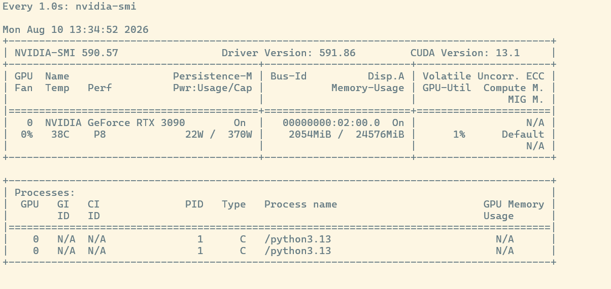
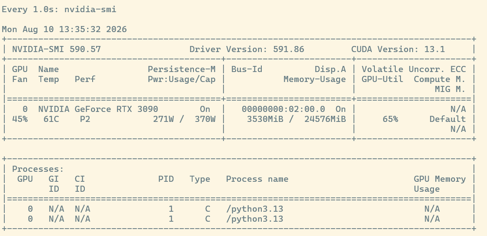
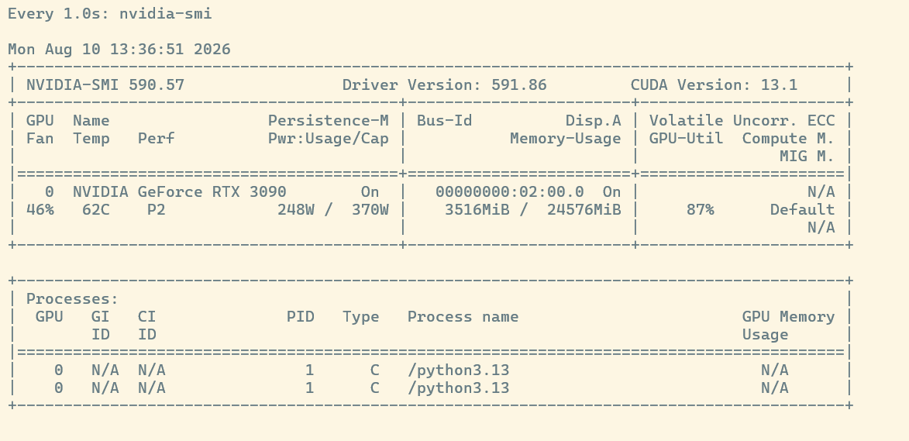

# Test Results Logs

### 1. Artifact Cache

#### 1.1 Cache Miss
```
benchmark start...
01: 2895.87 ms
02: 82.27 ms
03: 84.17 ms
04: 89.58 ms
05: 86.70 ms
06: 80.22 ms
07: 85.33 ms
08: 90.88 ms
09: 87.11 ms
10: 96.20 ms
11: 83.71 ms
12: 88.85 ms
13: 75.75 ms
14: 83.40 ms
15: 80.73 ms
16: 86.54 ms
17: 81.38 ms
18: 83.91 ms
19: 84.80 ms
20: 88.67 ms

=== Benchmark Result ===
count : 20
mean  : 225.80 ms
p50   : 85.07 ms
p95   : 236.18 ms
min   : 75.75 ms
max   : 2895.87 ms
```

#### 1.2 Cache Hit
```
warming up...
benchmark start...
01: 91.84 ms
02: 92.85 ms
03: 96.95 ms
04: 91.95 ms
05: 82.58 ms
06: 89.91 ms
07: 86.35 ms
08: 85.34 ms
09: 92.79 ms
10: 91.76 ms
11: 89.17 ms
12: 100.55 ms
13: 83.62 ms
14: 83.61 ms
15: 104.32 ms
16: 95.54 ms
17: 94.75 ms
18: 109.41 ms
19: 90.66 ms
20: 86.61 ms
21: 96.55 ms
22: 96.82 ms
23: 86.00 ms
24: 99.77 ms
25: 87.46 ms
26: 92.28 ms
27: 98.57 ms
28: 101.96 ms
29: 105.69 ms
30: 90.68 ms
31: 91.93 ms
32: 98.06 ms
33: 99.45 ms
34: 88.94 ms
35: 99.20 ms
36: 95.38 ms
37: 87.61 ms
38: 103.68 ms
39: 97.50 ms
40: 89.94 ms
41: 98.71 ms
42: 88.91 ms
43: 86.87 ms
44: 106.40 ms
45: 96.44 ms
46: 90.05 ms
47: 104.90 ms
48: 95.58 ms
49: 88.80 ms
50: 105.40 ms

=== Benchmark Result ===
count : 50
mean  : 94.20 ms
p50   : 92.82 ms
p95   : 105.40 ms
min   : 82.58 ms
max   : 109.41 ms
```
<br>

#### 1.3 Result
#### Cache Miss (20회)

| 항목 | latency    |
| --- |------------|
| artifact load | 20~22 ms   |
| dataframe build | 10~11 ms   |
| predict | 78~82 ms   |
| total | 115~120 ms |

<br>

#### Cache Hit (55회)

| 항목 | latency |
| --- | --- |
| artifact load | 0.07 ms |
| dataframe build | 9~10 ms |
| predict | 74~78 ms |
| total | 88~92 ms |

**Miss ≈ 118ms, Hit  ≈ 90ms**


<br>

### 2. NVIDIA GPU Time-Slicing

#### 2.1 Inference Only
```angular2html
Request Milliseconds
------- ------------
      1       414.87
      2       156.33
      3       158.76
      4       157.04
      5       157.99
      6       162.73
      7       150.48
      8       158.72
      9       167.95
     10       162.19
     11       150.23
     12       158.94
     13       185.44
     14       169.43
     15       177.33
     16       175.03
     17       188.37
     18       185.88
     19       187.18
     20       184.61
     
     

Warm 상태 GPU Inference
≈ 150~190ms
```
<br>

#### 2.2 Training + Inference

```angular2html
Request Milliseconds
------- ------------
      1       327.32
      2       332.88
      3        318.8
      4       325.73
      5       319.88
      6       316.99
      7       323.11
      8       316.74
      9       320.87
     10       318.68
     11        316.2
     12       319.34
     13       318.81
     14       316.26
     15       312.98
     16       320.62
     17        323.4
     18       315.26
     19       317.65
     20       321.81
     
     
170ms → 320ms
약 1.9배 증가

GPU 학습과 GPU 추론을 동시에 수행 가능
추론 지연은 약 2배 증가
```
<br>

#### 2.3 GPU Utilization

Idle


Training


Training + Inference


<br>

#### 2.4 Result
```
GPU Util은 65% → 87%로 증가  
추론 지연은 약 170ms → 320ms로 증가.  
VRAM 사용량 증가는 거의 없음.  
병목은 GPU Compute 자원 공유에 의해 발생한 것으로 추정.
```

<br>

### 3. Priority-based GPU Scheduling

#### 3.1 Single Inference Preemption 동작 로그

GPU에서 `training-184` 학습을 수행하던 중 GPU inference 요청을 발생시킴.

#### 1. Training의 학습중 로그

```
09:13:06.301 requested GPU: task_id=training-184
09:13:06.328 GPU acquired: task_id=training-184

09:13:08.449 GET /gpu/should-yield/training-184 200 OK
09:13:09.449 GET /gpu/should-yield/training-184 200 OK
...
09:13:15.452 GET /gpu/should-yield/training-184 200 OK
```

학습 작업 중 약 **1초 간격으로 더 높은 우선순위 작업이 대기 중인지 확인**함.

<br>

#### 2. 학습 도중 Inference 요청 발생

```
09:13:15.309 requested GPU:
task_id=inference-80127c3b-f820-40fd-8047-0be0cf1d98d7

09:13:15.326 POST /gpu/acquire 200 OK
```

`training-184`가 GPU를 사용하고 있는 도중 GPU inference 요청.

Inference Task는 scheduler의 waiting queue에 들어감.

<br>

#### 3. Training이 Inference 대기를 감지하고 GPU 양보

```
09:13:15.452 GET /gpu/should-yield/training-184 200 OK

09:13:15.469 POST /gpu/release 200 OK
09:13:15.474 POST /gpu/acquire 200 OK
```

Training이 다음 `should-yield` 검사에서 높은 우선순위의 inference를 발견.

현재 학습 상태를 **checkpoint로 저장한 뒤 GPU를 release**하고, training 자신은 Queue에 들어가서 
resume 우선순위로 다시 GPU 획득을 요청함.

<br>

#### 4. Inference가 GPU 획득 후 추론 실행

```
09:13:15.538 GPU acquired:
task_id=inference-80127c3b-f820-40fd-8047-0be0cf1d98d7

09:13:15.940 GPU inferenced completed.
latency=401.65 ms

09:13:15.945 POST /gpu/release 200 OK

POST /predict/120 HTTP/1.1 200 OK
```

Training이 GPU를 양보한 직후 inference가 GPU를 획득했고 정상적으로 추론까지 완료.

<br>

#### 5. Training이 GPU를 다시 획득하여 학습 재개

```
09:13:16.007 POST /gpu/acquire 200 OK

09:13:16.452 GET /gpu/should-yield/training-184 200 OK
09:13:17.453 GET /gpu/should-yield/training-184 200 OK
09:13:18.453 GET /gpu/should-yield/training-184 200 OK
```

Inference 종료 후 training이 GPU를 다시 획득하여 **checkpoint 이후부터 학습을 재개**.

최종적으로:

```
09:13:26.169 published topic: training-job-completed, key: 184
09:13:26.172 184 is done by GPU Worker
09:13:26.177 GPU released: task_id=training-184
```

학습 작업도 정상적으로 완료.

<br>

#### 3.2 Multiple Inference Preemption 동작 로그

GPU에서 `training-186` 학습이 진행 중인 상태에서   
inference 요청 5개를 거의 동시에 발생시킴.

#### 1. Training이 GPU를 점유하고 학습 시작

```
09:24:09.758 requested GPU: task_id=training-186
09:24:09.765 GPU acquired: task_id=training-186

09:24:11.092 GET /gpu/should-yield/training-186
09:24:12.093 GET /gpu/should-yield/training-186
09:24:13.093 GET /gpu/should-yield/training-186
09:24:14.095 GET /gpu/should-yield/training-186
```

`training-186`이 GPU owner가 되어 학습을 진행하며,   
약 1초 간격으로 더 높은 우선순위 작업의 존재 여부를 확인한다.

<br>

#### 2. 학습 도중 여러 Inference가 동시에 요청됨

```
09:24:14.876 requested GPU:
inference-396eb1d2...

09:24:14.925 requested GPU:
inference-b7166bd7...

09:24:15.080 requested GPU:
inference-ff241e7a...

09:24:15.278 requested GPU:
inference-ac42638b...

09:24:15.393 requested GPU:
inference-008dcb69...
```

여러 inference 요청이 짧은 시간 안에 들어왔지만   
GPU는 이미 training이 사용 중이므로 scheduler의 waiting queue에서 대기.

<br>

#### 3. Training이 높은 우선순위의 Inference 대기를 감지하고 GPU 양보

```
09:24:15.094 GET /gpu/should-yield/training-186
09:24:15.107 POST /gpu/release
09:24:15.111 POST /gpu/acquire
```

Training의 `should-yield` 검사에서 inference 발견.  
Training은 checkpoint 저장, GPU를 release, Queue에 들어가서 이후 학습 재개를 위해 다시 acquire 요청.

<br>

#### 4. 대기 중인 Inference들이 Training보다 먼저 순차 처리됨

첫 번째 inference:

```
09:24:15.200 GPU acquired: inference-396eb1d2...
09:24:15.234 GPU inferenced completed
09:24:15.239 GPU released
```

두 번째:

```
09:24:15.249 GPU acquired: inference-b7166bd7...
09:24:15.275 GPU inferenced completed
09:24:15.280 GPU released
```

세 번째:

```
09:24:15.301 GPU acquired: inference-ff241e7a...
09:24:15.329 GPU inferenced completed
09:24:15.335 GPU released
```

네 번째:

```
09:24:15.388 GPU acquired: inference-ac42638b...
09:24:15.412 GPU inferenced completed
09:24:15.416 GPU released
```

다섯 번째:

```
09:24:15.506 GPU acquired: inference-008dcb69...
09:24:15.530 GPU inferenced completed
09:24:15.538 GPU released
```

inference 하나가 끝났도 training이 바로 다시 GPU를 획득하지 못함.  
대기 중인 **동일한 고우선순위 inference들을 연속해서 먼저 처리한 뒤   
training으로 GPU 소유권이 돌아감.**

<br>

#### 5. Inference burst 종료 후 Training 재개 및 정상 완료

```
09:24:16.095 GET /gpu/should-yield/training-186
09:24:17.095 GET /gpu/should-yield/training-186
09:24:18.095 GET /gpu/should-yield/training-186
...
09:24:29.656 published topic: training-job-completed, key: 186
09:24:29.659 186 is done by GPU Worker
09:24:29.664 GPU released: task_id=training-186
```

모든 inference 요청이 처리된 뒤 training이 GPU를 다시 획득하여   
저장했던 checkpoint 이후의 학습을 이어감, 정상 완료.

<br>

#### 3.3 Result

장시간 GPU Training 도중 Inference 요청이 발생하면 Training Task는 GPU 사용권을   
release하고 Inference가 먼저 처리됨. 대기 중인 고우선순위 Inference들이 더 있는 경우  
Inference들을 먼저 순차 처리한 뒤 Training을 재개됨.  
